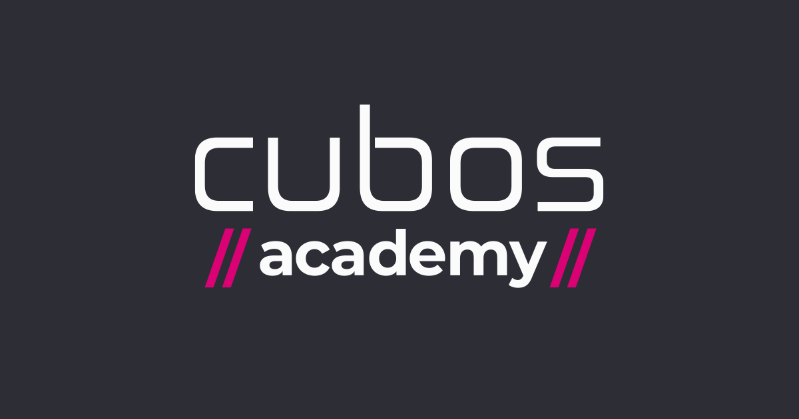

<p align="center">
  
</p>

<h1 align="center">Cubos Academy:<br>
  Exercício Aula 01 - Setup de ferramentas.</h1>

- Esse repositório é fruto da atividade referente ao primeiro dia de aula do curso **Desenvolvimento de Software - Foco em Backend - iFood**.
- O objetivo é explorar as principais ferramentas de versionamento utilizando Git + GitHub, onde foram utilizados os seguintes comandos:

```
1. git clone

2. git add .

3. git commit -m "message"

4. git push origin main
```

- A sequência de comandos foi utilizada para criar uma cópia local do repositório criado remotamente no GitHub. Dessa forma foi possível editar e adicionar arquivos de forma local e posteriormente atualizar o repositório remoto com as mudanças, simulando o básico do que seria um fluxo de trabalho real.

<hr>

**Autor:**

- Lukas Veiga.
- [Linkedin](https://www.linkedin.com/in/lukas-veiga-79371b20a/).
